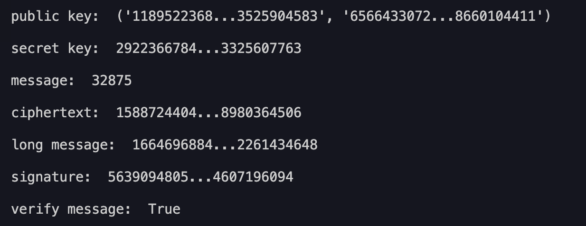

# RSA

> A quick implementation of RSA in Python.



## Getting started

### Prerequisites

- Python 3.11 or higher
- An editor or simply a terminal

### Install

To install the repository, simply download the zip file, or clone it using:

```bash
git clone https://github.com/MorganKryze/RSA.git
```

Then navigate to the directory and install the dependencies using:

```bash
cd RSA
pip install -r requirements.txt
```

### Usage

To use the program, simply run the `demo.py` file using Python.

```bash
python src/demo.py
```

## License

This project is licensed under the MIT License - see the [LICENSE](LICENSE) file for details.
